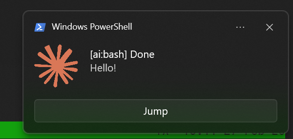

# wsl-claude-notifier

> Windows toast notifications for [Claude Code](https://docs.anthropic.com/en/docs/claude-code) and [Codex CLI](https://github.com/openai/codex) in WSL2 — with tmux session awareness and one-click window jump.

[中文说明](README.zh-CN.md)



## Why?

[Claude Code](https://docs.anthropic.com/en/docs/claude-code) and [Codex CLI](https://github.com/openai/codex) are terminal-based AI coding agents. But if you're running them inside **WSL2**, there's no built-in way to surface completion events as **Windows notifications**. You end up alt-tabbing back to check constantly.

It gets worse with **tmux** — multiple AI sessions across different windows, and no way to know *which one* needs attention, let alone jump to it.

This tool bridges that gap:

- **Windows native toast** — real Win11 toast notifications via [BurntToast](https://github.com/Windos/BurntToast) when your AI agent stops or needs input
- **Multi-tool support** — works with both Claude Code (hooks) and Codex CLI (notify)
- **Tmux-aware** — notification title shows `[session:window]` so you instantly know which session finished
- **One-click jump** — click "Jump" on the toast to activate Windows Terminal and switch directly to the right tmux window _(pane-level jump is WIP)_
- **Tool icons** — Claude and Codex notifications support separate icons for clear visual identification
- **Zero config** — one script installs everything: PowerShell module, shell scripts, custom protocol handler, tool-specific config

## Tested Environment

- Windows 11 + Windows Terminal
- WSL2 (Ubuntu)
- tmux

## Quick Install

Install for the tools you use — run one or both:

```bash
git clone <repo-url>
cd wsl-claude-notifier

# For Claude Code users
bash install-claude.sh

# For Codex CLI users
bash install-codex.sh
```

### What each installer does

**Shared steps** (both installers handle these, skipping if already done):
1. Install [BurntToast](https://github.com/Windos/BurntToast) PowerShell module
2. Deploy notification + jump scripts to `~/.local/bin/`
3. Deploy protocol handler + icons to `C:\Users\<YOU>\.wsl-claude-notifier\`
4. Register `tmux-jump://` custom protocol

**Claude Code** (step 5): Add hooks to `~/.claude/settings.json`

**Codex CLI** (step 5): Add `notify` to `~/.codex/config.toml`

## Prerequisites

- WSL2 with `jq` installed (`sudo apt install jq`)
- [Claude Code](https://docs.anthropic.com/en/docs/claude-code) CLI and/or [Codex CLI](https://github.com/openai/codex)
- tmux (recommended, works without it but no Jump button)
- Windows Terminal

<details>
<summary><h2>Manual Install</h2></summary>

### Step 1: Install BurntToast

```bash
powershell.exe -NoProfile -Command "Install-Module -Name BurntToast -Force -Scope CurrentUser"
```

### Step 2: Deploy scripts

```bash
# For Claude Code
cp scripts/wsl-tmux-notify.sh ~/.local/bin/
chmod +x ~/.local/bin/wsl-tmux-notify.sh

# For Codex CLI
cp scripts/wsl-codex-notify.sh ~/.local/bin/
chmod +x ~/.local/bin/wsl-codex-notify.sh

# Jump helper (shared)
cp scripts/tmux-jump.sh ~/.local/bin/
chmod +x ~/.local/bin/tmux-jump.sh
```

### Step 3: Deploy Windows-side files

```bash
WIN_USER=$(cmd.exe /C "echo %USERNAME%" 2>/dev/null | tr -d '\r')
mkdir -p "/mnt/c/Users/${WIN_USER}/.wsl-claude-notifier"
cp windows/tmux-jump.ps1 assets/icon.png "/mnt/c/Users/${WIN_USER}/.wsl-claude-notifier/"
cp assets/codex-icon.png "/mnt/c/Users/${WIN_USER}/.wsl-claude-notifier/"
```

### Step 4: Register protocol handler

```bash
# Replace <USER> with your Windows username
powershell.exe -NoProfile -Command @'
$proto = "tmux-jump"
$handler = 'powershell.exe -NoProfile -ExecutionPolicy Bypass -File "C:\Users\<USER>\.wsl-claude-notifier\tmux-jump.ps1" "%1"'
New-Item -Path "HKCU:\Software\Classes\$proto" -Force | Out-Null
Set-ItemProperty -Path "HKCU:\Software\Classes\$proto" -Name "(Default)" -Value "URL:tmux-jump Protocol"
New-ItemProperty -Path "HKCU:\Software\Classes\$proto" -Name "URL Protocol" -Value "" -Force | Out-Null
New-Item -Path "HKCU:\Software\Classes\$proto\shell\open\command" -Force | Out-Null
Set-ItemProperty -Path "HKCU:\Software\Classes\$proto\shell\open\command" -Name "(Default)" -Value $handler
'@
```

### Step 5a: Configure Claude Code hooks

Add to `~/.claude/settings.json`:

```json
{
  "hooks": {
    "Stop": [
      {
        "matcher": "",
        "hooks": [{ "type": "command", "command": "~/.local/bin/wsl-tmux-notify.sh" }]
      }
    ],
    "Notification": [
      {
        "matcher": "",
        "hooks": [{ "type": "command", "command": "~/.local/bin/wsl-tmux-notify.sh" }]
      }
    ]
  }
}
```

### Step 5b: Configure Codex CLI notify

Add to `~/.codex/config.toml`:

```toml
# Keep this at top level (before any [section] table).
notify = ["~/.local/bin/wsl-codex-notify.sh"]
```

</details>

## How It Works

```
Claude Code hook event (Stop / Notification)
  │  stdin: JSON with event type, message, cwd
  ▼
wsl-tmux-notify.sh ──────────────────────────────┐
                                                  │
Codex CLI notify (agent-turn-complete)            ├──► BurntToast toast notification
  │  last argv: JSON with type, last-assistant-message │    │
  ▼                                               │   Click "Jump"
wsl-codex-notify.sh ─────────────────────────────-┘        │
  ├─ Reads tmux session:window.pane                        ▼
  ├─ Builds BurntToast command + Jump button        tmux-jump:// protocol
  └─ PowerShell -EncodedCommand (UTF-16LE)                 │
                                                           ▼
                                                    tmux-jump.ps1
                                                     ├─ SetForegroundWindow() → activate Windows Terminal
                                                     └─ wsl.exe tmux-jump.sh → switch tmux window
```

## Uninstall

```bash
# Remove Claude Code components
bash uninstall-claude.sh

# Remove Codex CLI components
bash uninstall-codex.sh
```

Removes deployed files, registry entries, and tool-specific config.

## Troubleshooting

**No toast appears?**
- Test Claude Code notification:
  ```bash
  echo '{"hook_event_name":"Stop","cwd":"/tmp","last_assistant_message":"Test message"}' | ~/.local/bin/wsl-tmux-notify.sh
  ```
- Test Codex CLI notification:
  ```bash
  ~/.local/bin/wsl-codex-notify.sh '{"type":"agent-turn-complete","cwd":"/tmp","last-assistant-message":"Test message"}'
  ```
- Ensure `notify` is top-level in `~/.codex/config.toml` (before any `[section]` table):
  ```toml
  notify = ["~/.local/bin/wsl-codex-notify.sh"]
  ```
- Validate Codex config parse: `codex --version` (should not print a `config.toml` type error)
- Verify BurntToast: `powershell.exe -NoProfile -Command "Import-Module BurntToast; New-BurntToastNotification -Text 'Test'"`
- Check Codex icon file: `ls /mnt/c/Users/*/.wsl-claude-notifier/codex-icon.png`
- Check Windows notification settings (Settings > System > Notifications)
- Ensure `jq` is installed: `which jq`

**Jump button doesn't switch window?**
- Check current tmux target: `tmux display-message -p '#{session_name}:#{window_index}.#{pane_index}'`
- Test jump directly: `bash ~/.local/bin/tmux-jump.sh <session>:<window>.<pane>`
- Test protocol handler: `powershell.exe -Command "Start-Process 'tmux-jump://<session>:<window>.<pane>'"`
- Check handler exists: `ls /mnt/c/Users/*/.wsl-claude-notifier/tmux-jump.ps1`
- Check protocol log: `cat /mnt/c/Users/*/.wsl-claude-notifier/tmux-jump.log`

**No Jump button on toast?**
- Jump button only appears when running inside tmux (`echo $TMUX` should have output)

## License

[MIT](LICENSE)

Icon from [lobe-icons](https://github.com/lobehub/lobe-icons) (MIT License).
